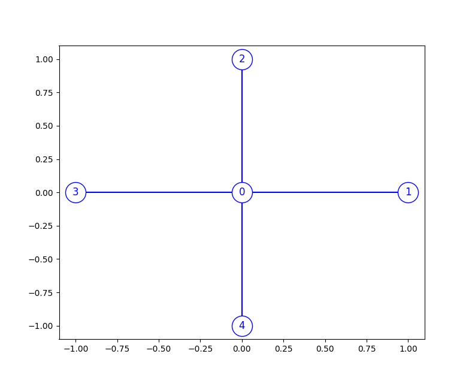

# FEM usage
In this experiment, we show how to compute the FEM solution of three different elliptic PDEs defined on the star-shaped graph in the figure.

  

In particular, we solve the following problems.

#### Constant function
First, consider the problem

$$
  \begin{cases}
    -\Delta u + (x^2+y^2+1) u = 5(x^2+y^2+1) & \quad \text{in } G \\
    \sum_{e \in E_v} \frac{\mathrm{d} u}{\mathrm{d} x^e}(v)=0 & \quad \forall v \in V
  \end{cases}
$$

which has the constant solution $u(x,y)=5$.

#### Linear function
Then, we test the mixed Dirichlet-Neumann-Kirchhoff problem with the following formulation

$$
    \begin{cases}
      -\Delta u + (x^2 + y^2 + 1) u = (x+y)(x^2+y^2+1) & \quad \text{in } G \\
      \sum_{e \in E_{v_0}} \frac{\mathrm{d} u}{\mathrm{d} x^e}(v_0)=0 \\ 
      u(v_1) = 1 \\ 
      u(v_2) = 1 \\ 
      u(v_3) = -1 \\ 
      u(v_4) = -1
    \end{cases}
$$

that has the solution $u(x,y)=x+y$.

#### Function of a single variable
Finally, consider the problem

$$
    \begin{cases}
      -\Delta u + u = (4\pi^2+1) sin(2\pi x) & \quad \text {in } G \\ 
      \sum_{e \in E_{v_0}} \frac{\mathrm{d} u}{\mathrm{d} x^e}(v_0)=0 \\ 
      u(v) = 0 & \quad \forall v \neq v_0
    \end{cases}
$$

which has the solution that is function only of $x$: $u(x,y)=sin(2\pi x)$.

You can see the simulation outputs in the [Python notebook](fem_usage.ipynb) file.
